# GitHub Pages 设置指南

本文档说明如何为 PyPI Crawler 项目设置 GitHub Pages 文档站点。

## 🎯 部署方式

我们使用 **构建后推送到 gh-pages 分支** 的方式，而不是 GitHub Pages Actions。

### 部署流程

```mermaid
graph LR
    A[推送到 main] --> B[触发 GitHub Actions]
    B --> C[安装 Node.js 依赖]
    C --> D[构建 VitePress 文档]
    D --> E[推送到 gh-pages 分支]
    E --> F[GitHub Pages 自动部署]
```



## 🔧 设置步骤

### 1. 启用 GitHub Pages

1. 进入 GitHub 仓库页面
2. 点击 **Settings** 标签
3. 在左侧菜单中找到 **Pages**
4. 在 **Source** 部分选择 **Deploy from a branch**
5. 选择 **gh-pages** 分支和 **/ (root)** 文件夹
6. 点击 **Save**

### 2. 配置 GitHub Actions 权限

1. 在仓库设置中，进入 **Actions** > **General**
2. 在 **Workflow permissions** 部分选择：
   - ✅ **Read and write permissions**
   - ✅ **Allow GitHub Actions to create and approve pull requests**

**重要**: 这是必需的，因为工作流需要推送到 `gh-pages` 分支。

### 3. 触发首次部署

推送任何对 `docs/` 目录的更改到 `main` 分支，或者手动触发工作流：

1. 进入 **Actions** 页面
2. 选择 **Deploy Documentation** 工作流
3. 点击 **Run workflow**

## 📁 项目结构

```
pypi-crawler/
├── docs/                          # 文档源码目录
│   ├── package.json               # Node.js 项目配置
│   ├── package-lock.json          # 依赖锁定文件
│   ├── .vitepress/
│   │   ├── config.js              # VitePress 配置
│   │   └── dist/                  # 构建输出（自动生成）
│   ├── *.md                       # 文档页面
│   └── scripts/                   # 文档相关脚本
└── .github/workflows/
    └── docs.yml                   # 文档部署工作流
```

## 🚀 工作流配置

### 触发条件
- 推送到 `main` 分支且 `docs/` 目录有变更
- 手动触发

### 构建步骤
1. **Checkout**: 检出代码
2. **Setup Node.js**: 安装 Node.js 18 和 npm 缓存
3. **Install dependencies**: 运行 `npm ci`
4. **Build**: 运行 `npm run docs:build`
5. **Deploy**: 推送构建产物到 `gh-pages` 分支

### 使用的 Action
- `actions/checkout@v4`: 检出代码
- `actions/setup-node@v4`: 设置 Node.js 环境
- `peaceiris/actions-gh-pages@v3`: 部署到 gh-pages 分支

## 🌐 访问地址

部署成功后，文档站点将在以下地址可用：

**https://scagogogo.github.io/pypi-crawler/**

## 🔍 故障排除

### 部署失败

1. **检查权限**: 确保 GitHub Actions 有写入权限
2. **检查分支**: 确保 `gh-pages` 分支存在且可访问
3. **查看日志**: 在 Actions 页面查看详细的构建日志

### 页面不更新

1. **清除缓存**: 强制刷新浏览器缓存 (Ctrl+F5)
2. **检查分支**: 确认 GitHub Pages 设置指向正确的分支
3. **等待时间**: GitHub Pages 部署可能需要几分钟时间

### 构建错误

1. **本地测试**: 运行 `./docs/scripts/test-docs.sh`
2. **检查依赖**: 确保 `package-lock.json` 是最新的
3. **Node.js 版本**: 确保使用 Node.js 16+

## 📝 本地开发

### 快速开始
```bash
# 设置环境
./docs/scripts/setup-docs.sh

# 开发模式
cd docs && npm run docs:dev
```

### 测试构建
```bash
# 测试完整构建流程
./docs/scripts/test-docs.sh
```

## 🔄 更新文档

1. 编辑 `docs/` 目录下的 Markdown 文件
2. 本地预览: `cd docs && npm run docs:dev`
3. 提交并推送到 `main` 分支
4. GitHub Actions 自动构建和部署

## 💡 最佳实践

1. **分离关注点**: Go 项目和文档项目完全分离
2. **自动化部署**: 推送即部署，无需手动操作
3. **版本控制**: 构建产物不进入版本控制
4. **缓存优化**: 利用 npm 缓存加速构建
5. **错误处理**: 完善的错误检查和日志记录

---

**🎉 恭喜！** 您的文档站点现在已经正确配置，将自动部署到 GitHub Pages！
